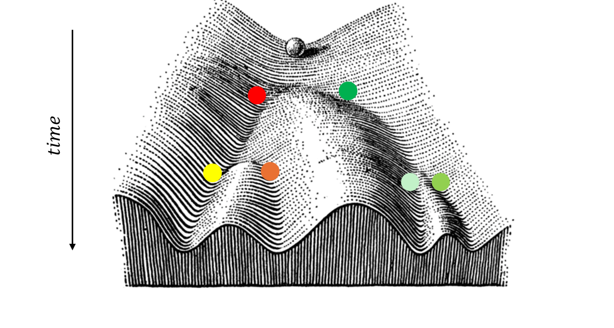

# Project: Visualizing Cell Differentiation



The current project consists in using gene expression data to visualize the differentiation trajectories of mouse embryonic stem cells. The gene expression dataset considered here was published by *Patrick S. Stumpf et al.* in  a paper titled *"Stem Cell Differentiation as a Non-Markov Stochastic Process," Cell Systems, 2017.* 
This is a guided project and all instructions can be found in the "cell_specification.ipynb" jupyter notebook. It is also expected that all written code reside in this file.

## Project Submission

To submit your project, please follow these steps:

1.  **Clone the repository**:
    Open your terminal in the folder where you want your project to live and run the following command to clone the repository to your local machine (**make sure that you have git installed in your machine**):
    ```bash
    git clone https://github.com/guijoe/visualizing-cell-differentiation.git
    ```

2.  **Complete the tasks**:
    Open the `cell_specification.ipynb` Jupyter notebook. Follow the instructions within the notebook and write your code directly in the cells provided.

3.  **Rename and move the notebook**:
    Rename the `cell_specification.ipynb` notebook to `cell_specification_your-name.ipynb` (e.g. cell_specification_joel-dokmegang.ipynb). **Move** this file to the "submissions" folder.

4.  **Create a new branch**:
    Before committing your changes, create a new branch using your name (e.g., `your-name`):
    ```bash
    git checkout -b <your-name>
    ```

5.  **Commit and push your changes**:
    Once you have finished the project, add and commit your changes:
    ```bash
    git add submissions/cell_specification_your-name.ipynb
    git commit -m "Completed cell differentiation project"
    ```
    Then, push your branch to the remote repository:
    ```bash
    git push origin <your-name>
    ```

6.  **Submit a Pull Request**:
    Go to the repository page on GitHub. You should see a prompt to create a Pull Request from your recently pushed branch. Click on it, review your changes, and submit the Pull Request for review.
